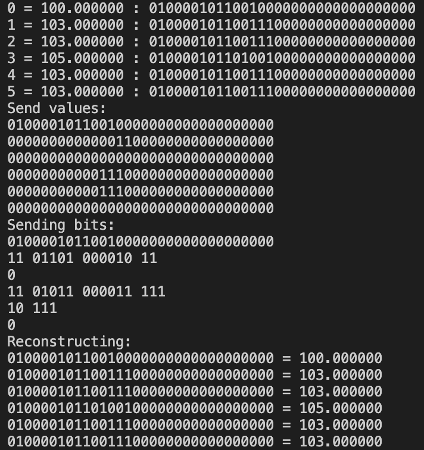
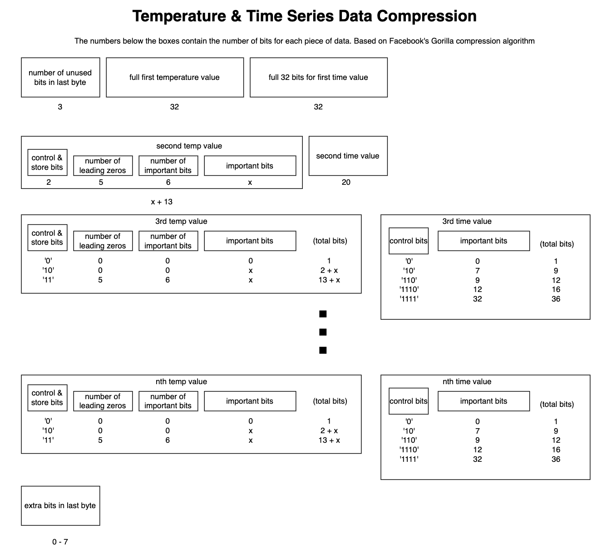

# Group 13 WIoT Final Project: Accumulated Temperature Data Compression

## Motivation:

Imagine a scenario where a remote research station in Antarctica required a temperature sensor to transmit long term readings of outdoor temperature back to the researchers stationed a moderate distance away. In such a scenario, it would be crucial to do this in a manner that would preserve as much of the limited power available as possible, yet maintain the range so that the research team would not have to brave the harsh temperatures getting close to the sensor.

## Our Solution:

A great protocol for this is LoRa because of its inherent long range and low power. But, a problem is that if we were to transmit every collected temperature value, we would waste power on the overhead required. So to minimize bandwidth, we will implement data compression on the LoRa device, send multiple temperature readings in one packet, and decompress them on the receiving end. And to make this interpretable, we will implement some sort of display for the collected data.

## Data Compression Algorithm:

The data we are sending is a type of time series because the temperature measurements are recorded sequentially in time. Because the measurements aren’t necessarily guaranteed to be equally spaced, we wanted to send both the temperature and the time for each measurement. The temperature received from the sensor is a float and the time sent is an unsigned int (32 bits) measured in seconds. We based our compression off of [Google’s Gorilla algorithm](http://www.vldb.org/pvldb/vol8/p1816-teller.pdf?ref=timescale.com).

The first float is sent in full, and all following values are sent as the XOR with the previous float. Because the floats are likely to be close in magnitude, there will likely be duplicated bits, which are then not transmitted. In order to take advantage of the smaller number of significant values, we employed methods to account for leading and trailing zeros. An example of the float compression in shown below:

The first int is sent in full, and the following int is sent as the difference between it and the first int. The third and following ints are encoded as the “delta-of-delta”, or the difference of difference between the current int and the previous and the difference between the previous and previous previous. Similarly, we employed techniques to account for the leading zeros. The overall packet structure is shown below:

Our algorithm averaged roughly 25% of the space compared to the full data. Our approach was completely lossless.

## LoRa Implementation:

The temperatures are recorded at an interval of one second (1000 ms) and the device sleeps in between recording the temperatures. Once either (1) the 47 byte buffer is full or (2) 30 recordings have been taken, a packet will be sent with compressed data. The reason for the 47 byte buffer is that the max payload size allowed in our region is 47 bytes with SF9 at 125 kHz. 

## GUI:

After decompressing the received data from the packet, we plot this data on a graph using Matplotlib. Every single time a packet is received on TTN, the new set of data is decompressed and appended to the already existing data, and the plot can be updated by closing the current one, and the new plot with the updated data is shown.
